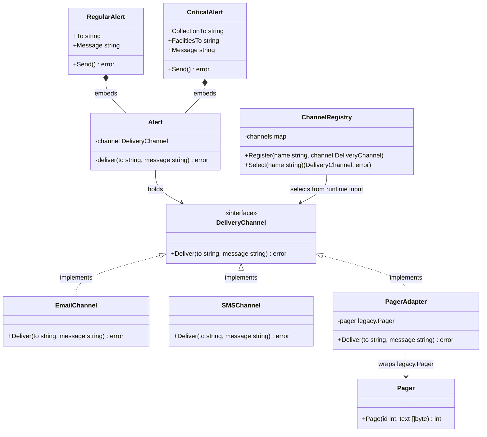

## UML class diagram

```mermaid
classDiagram
    class DeliveryChannel {
        <<interface>>
        +Deliver(to string, message string) error
    }

    class Alert {
        -channel DeliveryChannel
        -deliver(to string, message string) error
    }

    class RegularAlert {
        +To string
        +Message string
        +Send() error
    }

    class CriticalAlert {
        +CollectionTo string
        +FaciitiesTo string
        +Message string
        +Send() error
    }

    class EmailChannel {
        +Deliver(to string, message string) error
    }

    class SMSChannel {
        +Deliver(to string, message string) error
    }

    class PagerAdapter {
        -pager legacy.Pager
        +Deliver(to string, message string) error
    }

    class Pager {
        +Page(id int, text []byte) int
    }

    class ChannelRegistry {
        -channels map
        +Register(name string, channel DeliveryChannel)
        +Select(name string) (DeliveryChannel, error)
    }

    RegularAlert *-- Alert : embeds
    CriticalAlert *-- Alert : embeds
    Alert --> DeliveryChannel : holds
    DeliveryChannel <|.. EmailChannel : implements
    DeliveryChannel <|.. SMSChannel : implements
    DeliveryChannel <|.. PagerAdapter : implements
    PagerAdapter --> Pager : wraps legacy.Pager
    ChannelRegistry --> DeliveryChannel : selects from runtime input
```